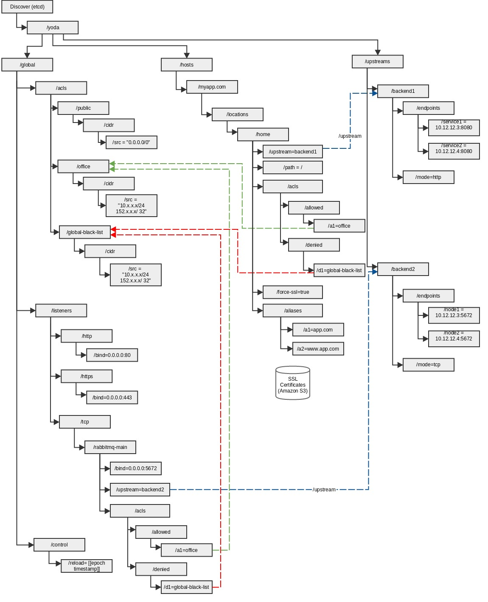

Yoda
====
<pre>
____    ____ ______   _______      ___       .______  .______       ______  ___   _______    ____
\   \  /   //  __  \ |       \    /   \      |   _  \ |   _  \     /  __  \ \  \ /  /\   \  /   /
 \   \/   /|  |  |  ||  .--.  |  /  ^  \     |  |_)  ||  |_)  |   |  |  |  | \  V  /  \   \/   / 
  \_    _/ |  |  |  ||  |  |  | /  /_\  \    |   ___/ |      /    |  |  |  |  >   <    \_    _/  
    |  |   |  `--'  ||  '--'  |/  _____  \   |  |     |  |\  \----|  `--'  | /  .  \     |  |    
    |__|    \______/ |_______//__/     \__\  | _|     | _| `._____|\______/ /__/ \__\    |__|  
</pre>


Yoda provides a dynamic proxy solution using haproxy, etcd and confd. 
A lot of code/config has been ported from deis project. The etcd structure 
has been adopted based on Vulcand project.

 

## Status
**In Development**

## Running Proxy

In order to run proxy, you need docker v1.1.0+ installed on your host. 

### Execution without SNI SSL Certificates
```
sudo docker run --name yoda --rm -t -i -P -p 80:80 -p 443:443 -p 2022:22 totem/yoda-proxy
```

### Execution with SNI SSL Certificates
In order to run with SNI certificates, you need to have Amazon S3 account with
read permission on ssl certificates bucket. Your S3 certificates should be 
grouped together with key prefix (or fodler name "certs.d"). 
E.g.:
yoda-s3-bucket/certs.d/certificate1.pem yoda-s3-bucket/certs.d/certificate2.pem
For SNI to work, ensure that each PEM certificate consists of : 
Private Key, Public Key, CA Chain (In this order).  

In order to start the proxy instance, run command:  

```
sudo docker run --name yoda --rm -t -i -P -p 80:80 -p 443:443 -p 2022:22 -e AWS_ACCESS_KEY_ID=<<S3_ACCESS_KEY_ID>> -e AWS_SECRET_ACCESS_KEY=<<S3_SECRET_KEY>> -e S3_YODA_BUCKET=<<S3_BUCKET_NAME>> -e SYNC_CERTS=true totem/yoda-proxy
```


